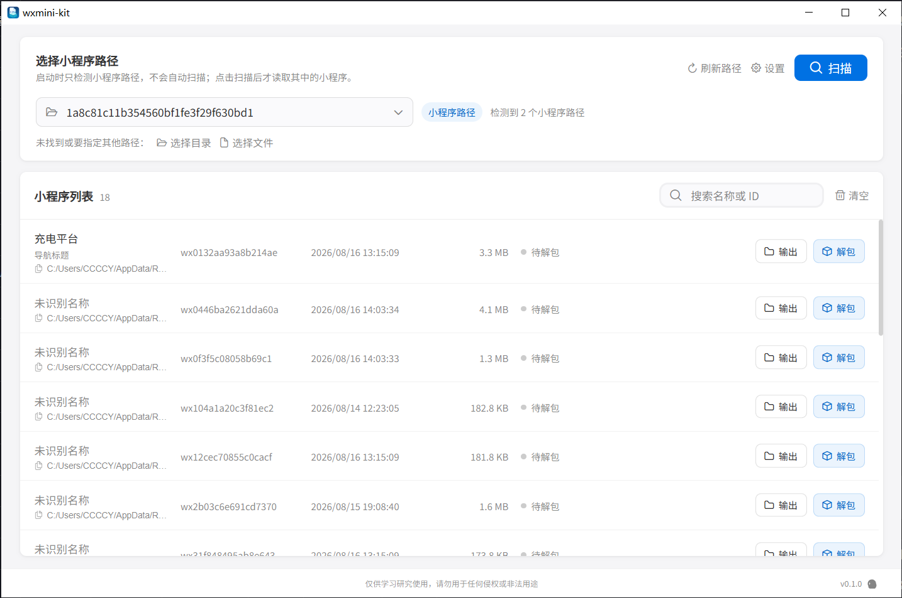

# wxmini-kit

基于原版 [wxapkg](https://github.com/wux1an/wxapkg) 重构的微信小程序包解析、解包和源码恢复工具。

项目使用 Wails + Vue + Go 构建，保留原有 wxapkg 基础解析能力，并重构了源码恢复流程和 JavaScript 美化器。

> 本项目仅用于学习、研究和合法的软件分析。请确保你拥有待处理文件的合法权限，并遵守当地法律法规、微信平台规则以及原项目和第三方依赖的许可证要求。

## 主要功能

支持扫描或手动选择 Windows、macOS 上的微信小程序包，解析并解包 wxapkg 文件，尽可能恢复 JavaScript、JSON、WXML、WXSS 和 WXS 等源码文件，同时提供代码美化和语法校验能力。

## 支持平台

| 平台 | 自动扫描 | 手动解包 | 发布版本 |
| --- | --- | --- | --- |
| Windows x64 | 支持 | 支持 | <code>wxmini-kit-windows-x64.zip</code> |
| macOS Universal | 支持 | 支持 | <code>wxmini-kit-macos-universal.zip</code> |

当前只对 Windows 和 macOS 提供官方构建、发布和微信目录自动扫描支持。

## 下载

前往 [Releases](https://github.com/CCCCY-ci/wxmini-kit/releases) 下载对应平台的版本。

- Windows 压缩包内包含 <code>.exe</code> 文件；
- macOS 压缩包内包含支持 Intel 和 Apple Silicon 的 Universal App。

## 本地构建

环境要求：

- Go 1.25 或更高版本；
- Node.js 22 LTS 或更高版本；
- npm；
- Wails CLI v2.14。

安装 Wails CLI：

~~~bash
go install github.com/wailsapp/wails/v2/cmd/wails@v2.14.0
~~~

安装前端依赖：

~~~bash
git clone https://github.com/CCCCY-ci/wxmini-kit.git
cd wxmini-kit/frontend
npm ci
cd ..
~~~

开发运行：

~~~bash
wails dev
~~~

构建当前平台版本：

~~~bash
wails build
~~~

构建结果位于 <code>build/bin/</code>。

在对应的目标系统上构建指定版本：

~~~bash
# Windows x64
wails build -platform windows/amd64

# macOS Universal
wails build -platform darwin/universal
~~~

macOS 需要安装 Xcode Command Line Tools：

~~~bash
xcode-select --install
~~~

Windows 10/11 需要可用的 Microsoft Edge WebView2 Runtime。

## 说明

源码恢复基于小程序编译产物进行静态分析，不能保证完全还原开发者最初编写的源码。注释、变量名、动态生成内容以及不同微信编译版本中的特殊结构，可能会存在差异。

本项目是在原版 wxapkg 基础上的重构版本，不代表原项目作者对本项目的维护或发布提供担保。使用时请同时遵循原项目和第三方依赖的许可证要求。

## 参考

- 基线项目：[wux1an/wxapkg](https://github.com/wux1an/wxapkg)
- 桌面应用框架：[Wails](https://wails.io/)
- JavaScript 美化器基础项目：[ditashi/jsbeautifier-go](https://github.com/ditashi/jsbeautifier-go)

## 免责声明

本项目仅限于学习、研究和合法的软件分析用途。使用者必须确保对所处理的小程序包及相关文件拥有合法权限，并自行遵守适用的法律法规、微信平台规则以及第三方软件许可证。严禁将本项目用于侵犯他人隐私、知识产权、商业秘密或绕过任何访问控制。因使用本项目产生的任何直接或间接后果，由使用者自行承担。
